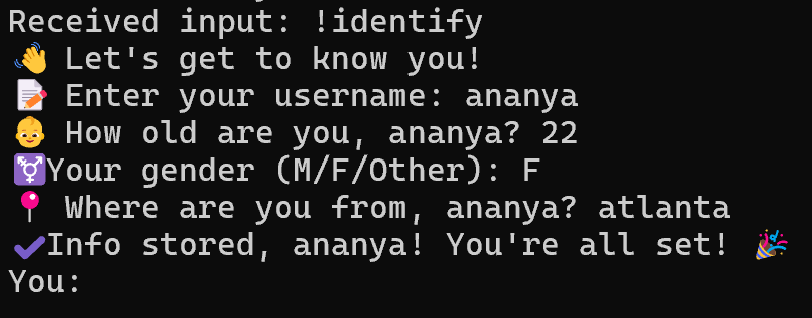
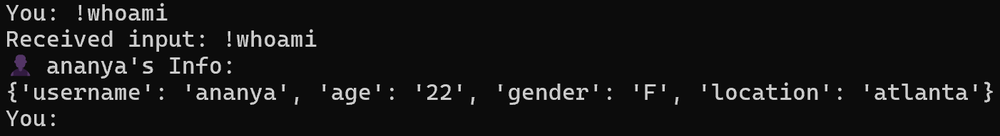
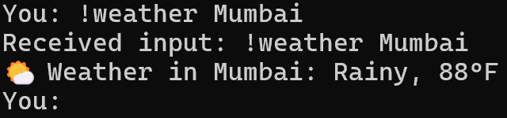
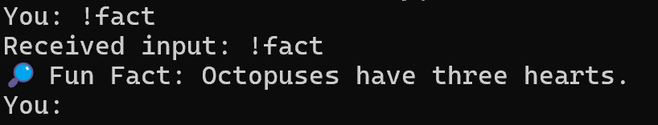
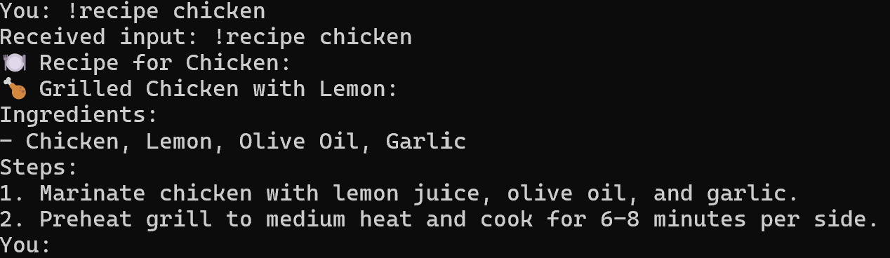
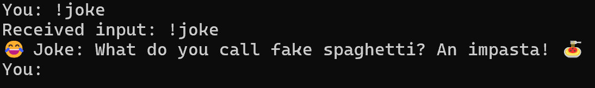
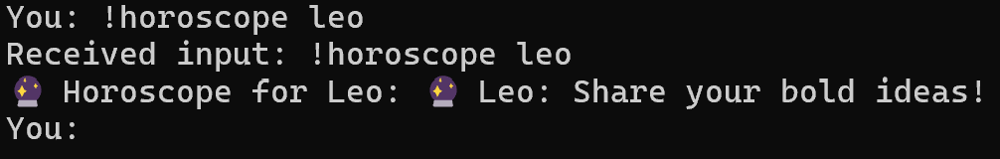
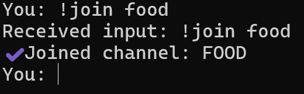
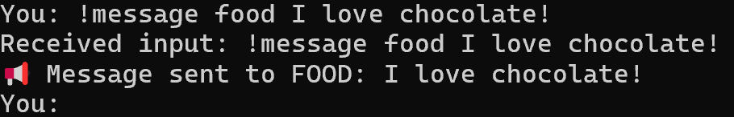
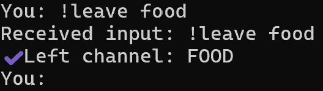

# PowerHouse: A Redis-Powered Chatbot

Author: Ananya Nimbalkar

This project is a simple chatbot built using Python and Redis's Pub/Sub mechanism. The chatbot supports multiple features such as user identification, messaging, weather updates, fun facts, recipe suggestions, jokes, and daily horoscopes. The bot runs inside Docker containers using `docker compose` and interacts with Redis for data storage and real-time messaging.

## Prerequisites
- **Docker** and **Docker Compose** must be installed on your system. You can install them from [Docker's official website](https://www.docker.com/get-started).
- **Python** must be installed to execute Python scripts.

## Setup Instructions
1. Clone the Repository
- Clone the project repository to your local machine: git clone <https://github.com/ananim30j/ProjectsPortfolio/tree/main/RedisChatbot>
- Navigate into the project directory where the code and files are located: cd <RedisChatbot>

2. Modify the docker-compose.yml File
- Under 'volumes', modify the file path to the left of the ':' so it matches the local path on your machine where the project is stored
    - It will the one directory above the file path for docker-compose.yml
    - Example: If your project is located in C://Users//yourname//projects//redis_chatbot, change the 'volumes' section to: volumes:
        - C://Users//yourname//projects//redis_chatbot:/usr/ds5760
- Verify the chatbot_functions.py is also in the same file path

3. Build & Run the Docker Containers
- Open Docker Desktop and have it running
- Open a terminal (1) and 'cd' into the directory you just inserted in the .yml file
- Use this command to build and start the Redis & Python containers: docker compose up --build
    - This will build the Docker image for the chatbot

4. Interact with the Chatbot
- Open another terminal (2) and 'cd' into the same directory
- Run the following command to connect to the chatbot container: docker exec -it slim-python bash
- Run 'pip install redis' to import the library
- Run 'python chatbot_functions.py' so the chatbot can start running

5. Monitory Redis Interactions
- Open a new terminal (3) and 'cd' into the same directory
- To monitor the Redis server in real-time, you can run the command: docker exec -it redis-chatbot redis-cli
- Then run 'MONITOR'
    - This will show you the Redis commands being executed as you interact with the chatbot

6. Stopping & Removing Containers
- Open one more terminal (4) and 'cd' into the same directory
- Once the testing of the chatbot is done, you can stop the container using the command: docker compose down
    - This will stop & remove the containers but keep the image intact
- If you make any changes to the project files, such as modifying the Python code, you can rebuild the container using the command: docker compose up --build
    - This ensures the changes are reflected when the containers are restarted

## Features
- **User Identification**: Users can identify themselves with their username, age, gender, and location. This information is stored in Redis and can be fetched with the '!whoami' command.
- **Weather Updates**: The bot can provide mock weather updates for predefined cities.
- **Fun Facts**: The bot shares a random fun fact.
- **Recipe Suggestions**: The bot provides recipe suggestions based on an ingredient.
- **Jokes**: Get a random joke from the bot.
- **Horoscopes**: The bot can provide daily horoscopes for all zodiac signs.
- **Channel Messaging**: Users can join or leave channels and send/receive messages in real-time.
- **Real-time Monitoring**: All interactions are logged and can be monitored in Redis using `redis-cli MONITOR`.

## Example Usage
- !identify
    - Answer the questions one by one, where the chatbot asks you to enter your username, age, gender, and location
    - Redis Monitor Display: "SET" "user:ananya" "{\"username\": \"ananya\", \"age\": \"22\", \"gender\": \"F\", \"location\": \"atlanta\"}"

- !whoami
    - Outputs your most recent user's information you entered
    - Redis Monitor Display: "GET" "user:ananya"

- !weather Mumbai
    - Fetches the weather of Mumbai
    - Redis Monitor Display: "GET" "mumbai"

- !fact
    - Outputs a random fun fact
    - Redis Monitor Display: "PUBLISH" "fact_channel" "insert_fact_here"
        - insert_fact_here is the fact the chatbot outputs
    

- !recipe chicken
    - Provides a recipe that includes chicken, including other ingredients needed and the steps to make it
    - Redis Monitor Display: "GET" "recipe:chicken"
    

- !joke
    - Lists a random joke
    - Redis Monitor Display: "GET" "joke:1"
    

- !horoscope leo
    - Produces today's horoscope for the zodiac sign leo
    - Redis Monitor Display: "GET" "leo"
    

- !join food
    - Allows the user to join the food channel
    - Redis Monitor Display: "SUBSCRIBE" "food"
    

- !message food I love chocolate!
    - Allows the user to send a message saying they love 
    chocolate in the food channel
    - Redis Monitor Display: "PUBLISH" "food" "ananya: I love chocolate!"
    

- !leave food
    - Allows the user to leave the food channel
    - Redis Monitor Display: "UNSUBSCRIBE" "food"
    

## Generative AI Usage
Generative AI was used to mitigate some of the issues, as well as to enhance the chatbot. Here is a breakdown of the usage:
- Conversational Design & Interaction Flow
    - Helped break down identification process one piece of information at a time
    - Added conversational questions
- Emojis
    - Inserted emojis wherever applicable to improve visual appeal & user engagement
- Spacing & Input Formatting
    - Initially the chatbot had issues for handling user input when there were spaces in commands, such as asking for a weather update (!weather San Francisco)
    - Identified this issue & helped used split(maxsplit=1) to properly handle multi-word inputs
- Error Handling
    - Improved error handling mechanism to guide the user to provide correct inputs
- Content Creation
    - Aided in creating fun facts & jokes to be stored